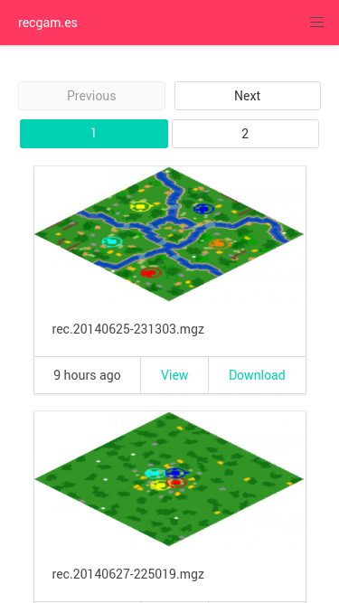

# [recgam.es][]

[recgam.es][] is a <abbr title="Free and Open Source Software">FOSS</abbr>
Age of Empires 2 recorded games storage, indexing and search service.

[Live Site][recgam.es] - [License][] - [Requirements][]




It's built on [Laravel][] and [RecAnalyst][].

## License

[GPL-3][]. See [COPYING][].

## Requirements

Running a local copy of [recgam.es][] requires:

 - PHP 7.0 or higher
 - The Imagick extension
 - A MySQL database
 - [Composer][], for PHP dependencies
 - [Node.js][], for frontend dependencies and code

## Setup

On the command line:

```sh
# Download the code
git clone https://github.com/goto-bus-stop/recgames
cd recgames
# Install dependencies
composer install
npm install
# Compile JS and CSS
npm run prod
# Run it!
php artisan serve
```

[License]: #license
[Requirements]: #requirements
[COPYING]: ./COPYING

[recgam.es]: https://recgam.es
[Laravel]: https://laravel.com
[RecAnalyst]: https://github.com/goto-bus-stop/recanalyst
[Composer]: https://getcomposer.org
[Node.js]: https://nodejs.org
[GPL-3]: https://www.tldrlegal.com/l/gpl-3.0
